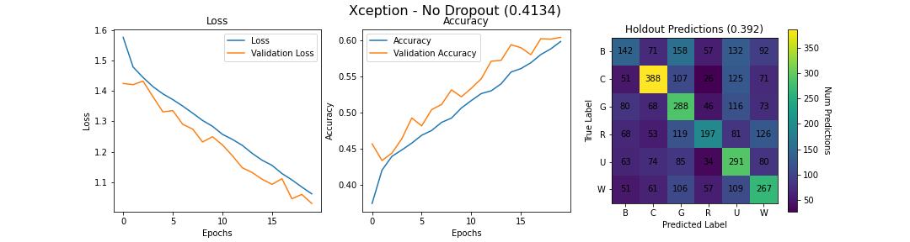
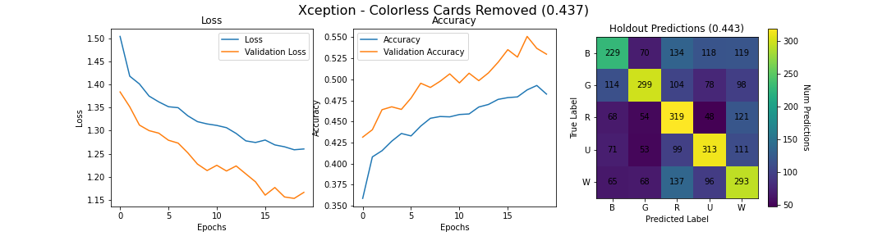

# *Magic* and Neural Nets: Classifying Trading Card Artwork with Tensorflow and CNNs

For my third Capstone project, I wanted to further explore computer vision and image processing using Convolutional Neural Networks with Keras and Tensorflow. As inspiration for the project, I decided to revisit the subject of my [first Capstone project](https://github.com/n-sweep/galvanize_capstone_1), the trading card game [*Magic: the Gathering*](https://mtg-archive.fandom.com/wiki/Card_Types). I wanted to find whether a Convolutional Neural Network could be trained to recognize the color of a card based only on the card's artwork (more on that below.) Already familiar with the API at [Scryfall.com](https://scryfall.com/docs/api), I knew that not only did they provide access to quality scans of the trading cards I wanted to classify, but their available data also included image files of the artwork alone, with the rest of the card cropped away - exactly what this project required. 

## Magic: the Gathering


Concieved and developed by mathematician Richard Garfield, *Magic: the Gathering* (commonly known as *MTG* or simply *Magic*) is a trading card game released by Washington State-based game publisher [*Wizards of the Coast*](https://en.wikipedia.org/wiki/Wizards_of_the_Coast) in 1993. Each card is printed with text and various symbols explaning how the card is used, as well as a unique piece of artwork to help bring the card to life. 

In the mid 90s, I was too young to really grasp the mechanics of the game but I had a family member, about 10 years my senior, who collected and played. I eventually rediscovered the game and played for many years, but I have fond memories of looking through his cards and admiring their fantastic artwork.

# Data


Over *Magic*'s nearly 30-year history, *Wizards of the Coast* has printed over 25,000 unique cards. They always keep balance in mind when designing new sets of cards, which leaves us with a conveniently pre-balanced distribution of colors across our data set.

*Magic* is a game of color: White, Blue, Black, Red and Green are core to how the game works and how it is designed. Color is often a player's first consideration when building a deck, a card's color tells what resources you need to play it and, on the subject of this project, the color can influence the art created for the card.

So, **can we train a neural network to predict the color of a card based on the artwork created for that card?**

Our neural net will consider ~19,000 images of *MTG* artwork gathered from Scryfall's convenient API and try to predict which of *Magic*'s five colors that card belongs to.

# Results
## A Baseline Model

I started with a baseline model consisting of 3 blocks of convolution and max pooling layers with a dropout of 20%, before flattening and passing through a fully connected dense layer.

```
Base Model Architecture:
Model: "sequential"
_________________________________________________________________
Layer (type)                 Output Shape              Param #   
=================================================================
conv2d_98 (Conv2D)           (None, 224, 224, 32)      896       
_________________________________________________________________
max_pooling2d_4 (MaxPooling2 (None, 112, 112, 32)      0         
_________________________________________________________________
conv2d_99 (Conv2D)           (None, 110, 110, 64)      18496     
_________________________________________________________________
max_pooling2d_5 (MaxPooling2 (None, 55, 55, 64)        0         
_________________________________________________________________
conv2d_100 (Conv2D)          (None, 53, 53, 128)       73856     
_________________________________________________________________
dropout_2 (Dropout)          (None, 53, 53, 128)       0         
_________________________________________________________________
max_pooling2d_6 (MaxPooling2 (None, 26, 26, 128)       0         
_________________________________________________________________
flatten_2 (Flatten)          (None, 86528)             0         
_________________________________________________________________
dense_4 (Dense)              (None, 512)               44302848  
_________________________________________________________________
dense_5 (Dense)              (None, 6)                 3078      
=================================================================
Total params: 44,399,174
Trainable params: 44,399,174
Non-trainable params: 0
_________________________________________________________________
```

The baseline nerual net performed a bit better than expected, yielding 38% accuracy on holdout predictions. Looking at the confusion matrix, it is good at classifying red cards, poor and classifying colorless cards and most misclassed cards are thought to be black or white.


## Transfer Learning

Next, I wanted to apply transfer learning, where we take a neural net pre-trained on millions of images and try to leverage all that training time against our data set. I tested a few popular options and eventually chose the Xception model (*Francois Chollet 2016*), trained on over 350 million images with over 17,000 classes.

```
Transfer Learning Architecture:
Model: "sequential"
_________________________________________________________________
Layer (type)                 Output Shape              Param #   
=================================================================
xception (Functional)        (None, 7, 7, 2048)        20861480  
_________________________________________________________________
global_average_pooling2d (Gl (None, 2048)              0         
_________________________________________________________________
flatten (Flatten)            (None, 2048)              0         
_________________________________________________________________
dense (Dense)                (None, 512)               1049088   
_________________________________________________________________
dense_1 (Dense)              (None, 5)                 2565      
=================================================================
Total params: 21,913,133
Trainable params: 21,858,605
Non-trainable params: 54,528
_________________________________________________________________
```

The first attempt at transfer learning bumped our accuracy up a bit. (39.2%)



Thinking that the colors in the artworks might be playing too strong a role in classification, I tried a run with grayscale images, (36.7%) before removing colorless cards altogether for the best accuracy yet. (44.3%)




Finally, increasing the training epochs by 250% did not yield any better results. (43.4%)


# Conclusions & Next Steps

```
Accuracies:
------------------
Random Guessing:           ~20%       (5 colors)
                           ~17%       (Colorless included)
Baseline Accuracy:          38.2%
Xfer Learning Accuracy:     43-44%
```

I came into this project knowing (or at least assuming) that the problem would be difficult, if not infeasable. That being said, I was pleased when my baseline model performed ~2x better than random guessing. I was disappointed when transfer learning failed to improve my score more than 6%, but again, this is a difficult problem. Art is extremely subjective, and *Wizards of the Coast* has employed many, many different artists over their years of printing cards. The game's 5 colors have strong themes that differentiate them from one another, but the artist ultimately chooses what themes to use and to what extent they employ them in their artwork.

Here we can see that the model is actually quite good at avoiding incorrectly predicting blue cards as red, but these examples with their red backgrounds and fiery elements fell into this category. I think this illustrates the inherent problem


We might be able to improve performance by doing further fine tuning of the transfer learning network, experimenting with different epoch settings or adding more input data. (I left out some sets of cards for various reasons.) However, a future possibility I am interested to explore predicting different targets, such as [card type](https://en.wikipedia.org/wiki/Magic:_The_Gathering_rules#Types_of_cards), with the artwork data set.

Ultimately, my goal for this project was to learn more about Tensorflow and image classification with convolutional neural nets. There is no monetary value or gameplay advantage to be gained from associating an attribute of a card with its artwork. So, despite being unable to get a better performing model, I feel that this project was successful.

## Technologies Used to Complete this Project


# Attributions

Immense thanks to our DSI instructors Dan Rupp and Juliana Duncan, and our DSR Kiara Hearn, not only for their support and assistance with this and our first two Capstone projects, but their general support and hard work throughout the DSI.

Thanks to all my fellow students who helped eachother along and provided feedback throughout the DSI - especially Thomas, who helped convince me to attend the DSI in the first place.

And special thanks to the developers at [Scryfall](https://scryfall.com/) for providing a quality API including and endpoint for images with *no rate limits.* Amazing.